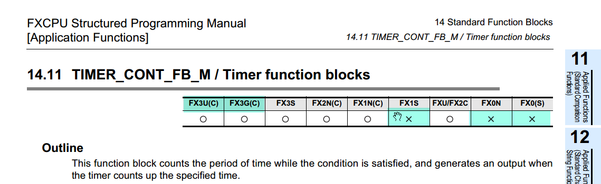

# Обзор программируемых логических контроллеров (ПЛК) серии FX

В этом курсе мы сосредоточимся на ПЛК серий FX3G и FX3U только, хотя линейка FX включает и другие модели, такие как FX1N, FX2N и FX2U. Да и сама серия FX3 уже не последняя, и на смену ей пришла более современная FX5. Почему же мы выбираем именно FX3G и FX3U для изучения?

## Причины выбора FX3G и FX3U

Основная причина — широкая доступность совместимых ПЛК. В какой-то момент прошивка ПЛК серий FX3G и FX3U стала общедоступной, что привело к появлению множества недорогих аналогов от китайских производителей. Эти совместимые ПЛК предлагают хорошее качество по доступной цене и выполняют задачи не хуже оригинальных контроллеров Mitsubishi. В отличие от FX3, для серии FX5 совместимых моделей нет, что ограничивает выбор только оригинальными устройствами, снижая гибкость для нас и наших клиентов.

Среди совместимых ПЛК модели FX3G и FX3U выделяются поддержкой наибольшего числа инструкций, что делает их оптимальным выбором для обучения и практического применения.

Контроллеры FX5 программируются в IDE GX Works 3. Это IDE следующего поколения. Если вы переживаете, что изучаете устаревшие технологии, и вы тратите время на то что через время станет не востребованным, должен вам сказать, хотя GX Works 3 и содержит новые возможности по сравнению с GX Works 2, их там не так много и движок ST там один и тот же. Изучив данный курс вы с легкостью сможете программировать оригинальные ПЛК Mitsubishi серии FX5* в GX Works 3.

## Почему мы используем ПЛК L02 от Coolmay?

В курсе мы будем работать с ПЛК серии L02 от китайского производителя Coolmay. Хотя большинство материала применимо и к оригинальным ПЛК Mitsubishi, выбор L02 обусловлен следующими преимуществами:

1. **Надежная поддержка ST-инструкций**
   ПЛК L02 гарантирует полную поддержку языка ST. В отличие от некоторых безымянных совместимых ПЛК, где даже простые конструкции ST могут не работать, L02 обеспечивает стабильную работу всех инструкций.

    !!! note "**Примечание**:"

        Некоторые могут задаться вопросом, почему ST вызывает проблемы, ведь ST это просто возможность IDE в нашем случае GXW и на чем бы не была написана программа она компилируются в список инструкций. Проблема часто связана с конструкцией `IF`, которая при компиляции генерирует точки `P`. В некоторых ПЛК поддержка таких точек ограничена, что приводит к сбоям в ST, но не в LD (Ladder Diagram). Мы подробнее разберем это при обсуждении компиляции.

2. **Проверенная надежность**
   За более чем три года работы с ПЛК L02 они зарекомендовали себя как надежные и стабильные устройства. Я уверенно использую и рекомендую их для различных проектов.

3. **Доступная цена**
   Стоимость L02 сопоставима с самыми бюджетными моделями, что делает их подходящими даже для проектов с ограниченным финансированием.

4. **Активное сообщество**
   Существует сообщество пользователей, программирующих ПЛК L02. В Telegram-группах можно быстро найти помощь и решить практически любую задачу в течение дня.

5. **Удобный форм-фактор**
   ПЛК L02 имеют продуманный дизайн с фронтальным подключением проводов, как у современных ПЛК от WAGO, Beckhoff и CREVIS. Это позволяет создавать компактные шкафы управления. Съемные клеммы упрощают замену модулей за считанные минуты.

6. **Широкий набор интерфейсов**
    L02 оснащены следующими интерфейсами:

    - 1×RS232 (протокол Mitsubishi, режим Slave);
    - 2×RS485 (протоколы Mitsubishi Slave, Modbus RTU Slave/Master, свободный протокол);
    - 1×Ethernet (протоколы Modbus TCP, EthernetIP);
    - 1×CAN (поддержка есть, но протоколы мне неизвестны).

    Этого достаточно для построения промышленных сетей даже в сложных системах.

7. **Встроенные аналоговые входы/выходы**
   Головной модуль L02 может включать до 4 аналоговых входов и 4 выходов (по два 0–10 В и 4–20 мА). Это делает ПЛК подходящими для малой автоматизации, например, для станков или небольших установок.

8. **Модульная расширяемость**
   В отличие от традиционных формфакторов ПЛК FX3 (например, FX3G-24MR с 12 входами и 12 выходами) или (FX3G-60MТ с 30 входами и 30 выходами) которые имеют фиксированное количество IO, L02 предлагают гибкую модульную архитектуру. Доступны две базовые модели — L02M24T и L02M32T, которые можно расширить до 500 входов/выходов с помощью модулей, линейка которых достаточно широкая и покрывает все базовые потребности, есть даже модель тензометрический. Также поддерживается подключение до 4 каплеров по EthernetIP, каждый из которых добавляет до 200 дополнительных входов/выходов.

Мне кажется L02 от Coolmay превосходит оригинальные ПЛК FX3G и FX3U по функциональности ну или как минимум по компактности. Эти контроллеры подходят не только для малой, но и для средней автоматизации, включая системы с более чем 1500 входов/выходов. Смело можно запустить небольшой цементный завод.

## Ограничения ПЛК L02

1. **Ограничение размера программы**
   Максимальный размер программы — 32 000 шагов. Этого обычно достаточно, но в некоторых проектах требуется оптимизация кода. Это ограничение заставило меня глубже изучить компиляцию и оптимизацию и писать компактные, но функциональные программы.

   Мне пока что 32000 хватало, но для этого приходилось сильно оптимизировать код. 32000 это не мало, но и не так много что бы писать код небрежно.

2. **Ограничения редактора ST**
   По сравнению с ПЛК на базе CoDeSys, редактор ST в L02 работает медленнее и имеет меньше возможностей. Например, нельзя создавать массивы функциональных блоков (FB) или использовать глобальные константы в функциях (FUN).

## Различия между FX3G и FX3U

FX3U и FX3G это просто режимы, одного и того же ПЛК. То-есть аппаратно это одно и тоже устройство например L02M24T, просто его можно перевести в режим FX3G или FX3U. По умолчанию ПЛК L02 идет в режиме FX3G.

!!! info "**Как переключать режимы?**"

    Для перевода ПЛК L02 в режим FX3U нужно присвоить регистру `D8396` значение **2**, и перегрузить ПЛК.

!!! danger "**Важно!**"

    Прежде чем переключить L02 в режим FX3U, убедитесь что у вас есть шнур от Coolmay для порта RS232 на ПЛК, и на ПК есть COM порт или рабочий адаптер RS232.

### Особенности режимов

Если мы будем ссылаться на документацию Mitsubishi то на каждой инструкции, вверху страницы справа у нас будет таблица, в каких ПЛК эта инструкция поддерживается.

На примере вы видите что инструкция `TIMER_COUNT_FB_M` не поддерживается в ПЛК FX1S, FX0N и FX0S.

Разница FX3U и FX3G заключается в поддерживаемых инструкциях, указанных в документации Mitsubishi. FX3U поддерживает больше инструкций, особенно для контроля позиционирования, но для большинства задач возможностей FX3G достаточно включая тот же контроль позиционирования или другими словами работу с серво или шаговыми двигателями.

На моей практике, даже содовая программы для станков с серво приводами, мне не пришлось переключать ПЛК в режим FX3U.

- **FX3U**:
    - Поддерживает чуть больше инструкции контроля позиционирования.
    - Поддерживает Ethernet для загрузки программ, но эта функция работает нестабильно.
    - Поддержка Mitsubishi TCP Slave
    - USB-порт Type-C не работает, загрузка программ возможна только через COM-порт с использованием кабеля DVP для ПЛК Delta (кабель FX для Mitsubishi не подходит).

- **FX3G**: Ограничен по инструкциям, но более универсален для базовых задач. Скорей всего вам ни когда не понадобиться переключаться в режим FX3U.
