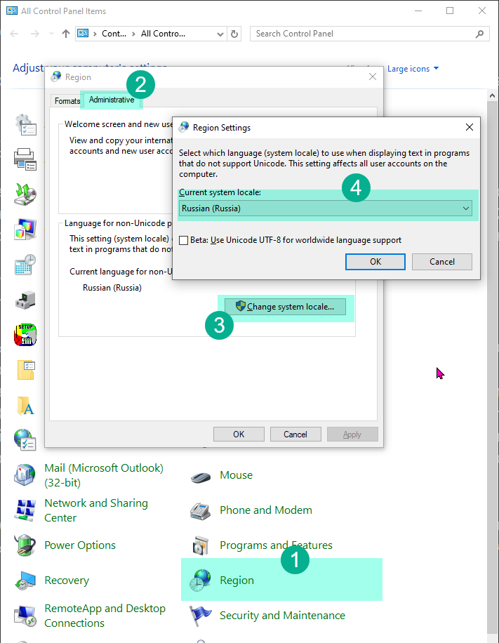

# Установка и первый запуск GX Works 2

Это руководство поможет вам шаг за шагом установить и настроить среду разработки GX Works 2 для программирования ПЛК Coolmay. Мы пройдем каждый этап максимально подробно, чтобы процесс был понятен даже для начинающих.

## 💿 Что такое GX Works 2?

**GX Works 2** — это программное обеспечение от компании Mitsubishi Electric, предназначенное для программирования их промышленных логических контроллеров (ПЛК) серии FX. Поскольку ПЛК от Coolmay совместимы с контроллерами Mitsubishi, мы можем использовать для работы с ними ту же самую профессиональную и мощную среду разработки.

## ⚙️ Процесс установки

Установка проходит в два ключевых этапа:

1. **Установка базовой версии.** Мы ставим основу программы.
2. **Установка обновления.** Поверх базовой версии мы устанавливаем более свежую, исправляющую ошибки и недочеты.

Этот двухэтапный процесс необходим, так как для установки обновления требуется наличие базовой версии.

### Шаг 1: Загрузка и подготовка файлов

Для начала необходимо скачать установочные файлы. Вы можете найти их на официальном сайте Coolmay или воспользоваться ссылкой с материалами курса, где собраны проверенные версии.

Вам понадобятся два архива:

* **GXW2-E-1.77F.zip** — базовая версия.
* **GX Works2 1.622Y EU.zip** — обновление.

После скачивания распакуйте архив **GXW2-E-1.77F.zip** в любую удобную папку на вашем компьютере. Для распаковки можно использовать встроенные средства Windows или программы вроде WinRAR или 7-Zip. Внутри вы найдете:

* Папку **Disk1** и **Disk2** — установочные файлы программы.
* Файл **Serial Number.txt** — текстовый файл с ключом продукта, который потребуется для активации.

### Шаг 2: Установка базовой версии

1. Откройте папку **Disk1** и найдите файл **setup.exe**. Это и есть установщик программы. Запустите его двойным щелчком мыши.

2. Откроется первое окно мастера установки. Здесь нужно ввести данные пользователя:
    * **User Name** (Имя пользователя) и **Company Name** (Компания): Можете ввести любые данные, эта информация ни на что не влияет.
    * **Product ID** (Ключ продукта): Теперь откройте файл **Serial Number.txt**, который был в архиве. Аккуратно скопируйте всю строку с серийным номером и вставьте ее в это поле. Убедитесь, что не захватили лишних пробелов.

    

3. Нажмите "Далее". На следующем экране вам предложат выбрать компоненты для установки. Это **очень важный шаг**.
    * Обязательно поставьте галочку напротив **Structured Text (ST)**. Structured Text (структурированный текст) — это современный язык программирования высокого уровня, похожий на Pascal. Он гораздо мощнее и удобнее для сложных задач, чем традиционные релейные схемы. Весь наш курс построен на использовании именно этого языка, поэтому без этого компонента обучение будет невозможно.

    

4. Продолжайте нажимать "Далее". Программа предложит выбрать папку для установки (можно оставить путь по умолчанию) и другие параметры. Для новичка лучше ничего не менять. Просто следуйте инструкциям мастера до тех пор, пока не начнется и не завершится копирование файлов.

### Шаг 3: Установка обновления

Мы установили основу, но это старая версия, в которой могут быть ошибки. Чтобы обеспечить стабильную работу, установим обновление.

1. Теперь распакуйте второй архив, **GX Works2 1.622Y EU.zip**, и запустите установку из него.
2. Процесс установки обновления гораздо проще. Здесь не нужно ничего вводить или выбирать. Просто нажимайте "Далее", пока процесс не завершится. Обновление автоматически установится поверх уже существующей программы.

> **Почему нельзя было сразу установить обновление?**
> Установщик обновления проверяет, есть ли на компьютере базовая версия. Если ее нет, он потребует другой ключ продукта, которого у нас нет. Поэтому такая последовательность — сначала база, потом обновление — является обязательной.

## 🖥️ Создание первого проекта

Установка завершена! Теперь найдите на рабочем столе или в меню "Пуск" ярлык GX Works 2 и запустите программу.

### Первое знакомство с интерфейсом

При первом запуске вы увидите, что почти все кнопки на панелях инструментов неактивны (серого цвета). Не пугайтесь, это нормально. Большинство профессиональных программ устроены так, что их инструменты становятся доступны только тогда, когда открыт или создан проект для работы.

Давайте создадим наш первый проект.

1. В главном меню сверху выберите **Project -> New...** (Проект -> Новый...). Альтернативно, можно нажать на иконку с изображением белого листа на панели инструментов.

    

2. Откроется окно создания проекта. Здесь нужно внимательно настроить все параметры:
    * **PLC Series** (Серия ПЛК): Выбираем **FXCPU**. Этим мы говорим программе, что будем работать с контроллерами семейства FX, к которому относятся и наши ПЛК Coolmay.
    * **PLC Type** (Тип ПЛК): Выбираем **FX3G/FXGC**. Внутри семейства FX есть разные модели. Модель L02, которую мы используем, по умолчанию определяется именно как FX3G. Если выбрать неверный тип, мы не сможем загрузить программу в контроллер.
    * **Project Type** (Тип проекта): Выбираем **Structured Project** (Структурированный проект). Это самый важный пункт. "Простой проект" (Simple Project) позволяет использовать только язык релейных схем. Только "Структурированный проект" открывает доступ к языку ST и другим продвинутым возможностям.
    * **Language** (Язык): Выбираем **ST** (Structured Text).

3. Нажмите **OK**. Проект будет создан.

### Что за окно про язык?

С большой вероятностью сразу после создания проекта появится небольшое информационное окно.

Оно выглядит как предупреждение об ошибке, но на самом деле это не так. Оно сообщает, что язык вашей операционной системы Windows и язык, установленный в GX Works 2, не совпадают в системных настройках для старых программ, не поддерживающих Юникод.

**Это ни на что не влияет.** Просто нажмите **OK**. Можете смело игнорировать это сообщение каждый раз, когда оно появляется.

Но если вы не хотите больше видеть это окно, можете воспользоваться инструкцией которая написана в этом окне, перейти в меню *Tools* - *Language Selection* и выбрать там тот язык, который у вас указан в системе как язык по умолчанию для программ не поддерживающих Unicode. К сожалению выбора русского языка нет, а это значит что вам придется поставить Английский язык в настройках системы. Найти их можно перейдя в контрольную панель, регион, вкладка Административные. Вот тут в этом окне поменять данные.

Поздравляем! Вы успешно установили программу и создали свой первый проект. Теперь среда разработки полностью готова к работе. В следующем уроке мы детально изучим ее интерфейс.
