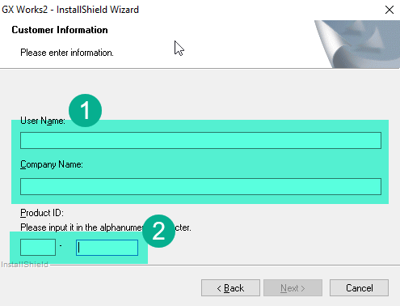
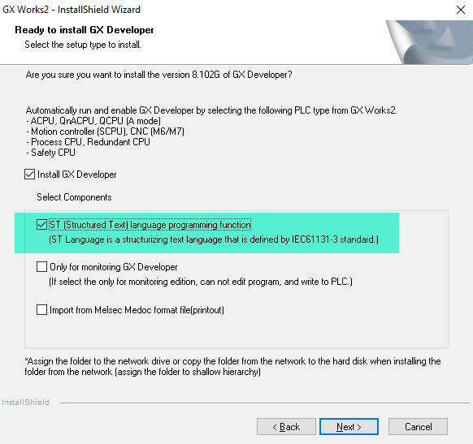

# Установка GX Works 2

Для работы с ПЛК Кулмэй официально мы можем скачать GX Works 2 с сайта Кулмэй. Можно так и сделать, а можно воспользоваться ссылкой по которой лежат все материалы которые мне удалось собрать за эти годы по этим контроллерам. Там есть папка софт, в ней находим файл **GXW2-E-1.77F.zip**.

Качаем и распаковываем **GXW2-E-1.77F.zip**. Внутри архива мы увидим 2 папки **Disk1** и **Disk2** и файл **Serial Number.txt**. Запомните его он нам будет нужен позже.

Заходим в папку Disk1 и запускаем **setup.exe**.

Первый экран мастера установки

1. Имя пользователя и компанию введите по своему усмотрению.
2. В поле Product ID введите серийный код который вы найдете в корне распакованного архива GX Works 2 в файле **Serial Number.txt**.

Второй экран мастера установки

Здесь важно поставить галочку поддержку программирования ПЛК на языке ST.

Жмем Далее все без изменения по умолчанию пока не завершим установку.

Но это еще не все. Это старая версия. В ней есть недочеты. Находим в папке Кулмэй файл **GX Works2 1.622Y EU.zip**, качаем его, и устанавливаем поверх.

Можно ли было сразу поставить эту версию? Возможно, я не пробовал. Мне показалось что она ставится как обновление, поэтому поставили их последовательно. 
