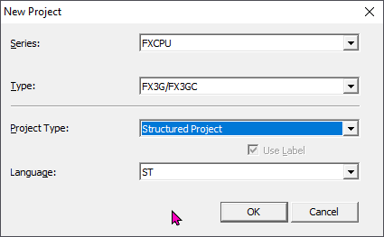
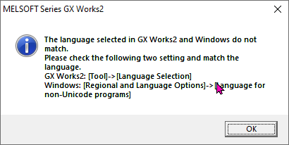

# Интерфейс GX Works 2

## 🖥️ Создание проекта

Запустим GX Works 2. Откроется программа но большинство инструментов будет недоступно, мы видим это потому что они серого цвета, например вот тут. Создадим проект и уже потом пройдемся по всем элементам интерфейса. Можем создать проект через меню *Projects* - *New...* или ЛКМ на вот этой иконке в стандартной панели инструментов.



Серия ПЛК нужно выбрать FXCPU

Тип FX3G/FXGC. Это важно, если вы не переключили ПЛК Л02 в режим FX3U то он автоматически в режиме FX3G а значит выбираем только этот тип ПЛК. Иначе мы не сможем потом залить проект в ПЛК.

Тип проекта Structured Project. Если выбрать другой тип проекта то язык ST будет не доступен.

Теперь выбираем язык на котором мы будем программировать - ST

Жмем ОК.

Проект создался. Если у вас вылетит вот такое окно



Это просто информация о том что язык операционной системы и настроек GX Works 2 не совпадает. Нужно нажать ОК. Это ни как не отразится ни на чем. Но если вы не хотите больше видеть это окно, можете воспользоваться инструкцией которая написана в этом окне, перейти в меню *Tools* - *Language Selection* и выбрать там тот язык, который у вас указан в системе. К сожалению выбора русского языка нет, так что вам придется поменять язык по умолчанию для не юникода. Короче проще не обращать на это внимания.

## 👁️‍🗨️ Интерфейс

Интерфейс GX Works 2 сделан приближенно к Visual Studio, думаю тем кто открывал подобное, будет понятно большинство элементов интерфейса.

### 1️⃣ Меню

В любой программе есть меню. Это стандартный интерфейс любого приложения.

Мы сейчас не будем проходить по всем командам меню и каждую объяснять, потому что без контекста все равно будет трудно запомнить сразу все. И вообще описание как работают разные элементы интерфейса GX Works 2 мы будем делать по ходу изучения когда эти элементы нам понадобятся, и к концу курса надеюсь ни останется ни одной кнопки, команды, окна или панели, действие которой осталось бы не понятно.

Замечание по меню *View* и *Edit*. Если все пункты всех других меню содержат постоянный набор команд, то список команд меню *View* и *Edit* меняется в зависимости от типа открытого окна в рабочей области. Посмотрите если я выберу редактор *Labels* или переменных, то вот так выглядит меню *View* а если выберу редактор кода, то меню будет выглядеть вот так. Меню *view* и *Edit* является динамическими, и их набор команд зависит от выбранного типа окна в рабочей области. Пример меню *Edit* мы увидим чуть позже.

Для многих кто всегда стремится к максимальной продуктивности будет полезно знать что по этому меню можно перемещаться не касаясь мышки. По сути это работает в любой программе. Например в Microsoft Office или Photoshop. Скорей всего вы это уже знаете, но для тех кто не знает, если нажать клавишу ++alt++ то первый элемент меню подсветиться. Далее можно при помощи клавиш ++up++, ++down++, ++right++, ++left++ перемещаться по элементам меню, и клавишей ++enter++ выполнить команду меню.

Но есть еще более быстрый способ. Когда мы нажмем ++alt++, обратите внимание что некоторые буквы в меню элемента подчеркнуты. Если мы нажмем данную букву, то сразу перейдем в это меню. Например в меню *Tools* подчеркнута буква Т. Нажмем клавишу ++"T"++ на клавиатуре, и мы перешли в меню *Tools*. В выпавшем меню, мы видим что в каждой команде тоже есть подчеркнутая буква. Например мы хотим открыть настройки *Options...* это буква О. Нажмем клавишу ++"О"++ и у нас откроются окно настройки.

Со временем вы выучите последовательности и будете быстро ими пользоваться. Вот попробуйте сами быстро нажать последовательность клавиш ++alt+"T"+"O"++. Буквально секунда и окно открыто. А если взять в расчет что меню GX Works 2 содержи все возможные команды, включая все что есть в панели инструментов, то можно не настраивать быстрых клавиш, а просто запомнить эти последовательности. Быстрые клавиши не удобны тем, что если ими не пользоваться, то можно быстро забыть комбинацию, а тут даже если забыл чтобы нажать клавиши быстры, можно медленно пройти по меню и вспомнить.

### 2️⃣ Панель инструментов

Панель инструментов содержит всего 5 групп инструментов. Если мы ПКМ в пустом месте панели инструментов, то в контекстом меню увидим список всех доступных групп. Тут же можно отключать вы включать группы.

Кратко о каждой группе.

**1. Inelegant Function Module**

Начнем с *Inelegant Function Module*. Эту группу мы ни когда не будем использовать. Просто ее отключим, и не будем о ней говорить. На сколько я понимаю эта группа позволяет управлять подключенными модулями. Возможно это пригодиться если работать с оригинальными ПЛК Mitsubishi, но работая с ПЛК Л02, это не нужно. В Л02 модули становятся частью самого ПЛК.

**2. Standard**

Группа инструментов стандарт. Здесь у нас содержатся кнопки создания проекта, открытия проекта, печати текущей рабочей области, и поиск по документации. Можно открыть документацию.

Нужно к ней привыкнуть но она может быть иногда полезна, быстро подсмотреть какие параметры входят в инструкцию. Например найду инструкцию `MOV`. постоянно раньше забывал какой параметр это значение. Тут быстро вижу что есть 2 параметр S и D где S это значение а D регистр куда его записать. И вижу порядок ввода значений.

К сожалению здесь нет примеров на ST зато они есть в других руководствах. В уже известной вам папке, если перейти в директорию *Documentation/EN/Mitsubishi/FXCPU Structured Programming Manual [Basic & Applied Instruction].pdf* то тут уже все инструкции будет с примерами на ST что бывает очень удобно.

**3. Program Control**

Как понятно из названия, это группа управления программой. Стандартные копировать, вырезать вставить, анду и реду. Поиск по разным сущностям, загрузка выгрузка программы, мониторинг, компиляция и симуляция. Эта группа которой мы будем пользовать чаще всего, сейчас ни чего не буду объяснять по ходу обучения изучим все инструменты этой группы.

**4. Docking Window/Switch Project Data**

Здесь можно включить вы включить плавающие панели. Их тут множество и мы о них поговори позже. Но как пример, вот кнопка панели навигации по проекту, видите она включает и выключает панель структуры проекта.

**5. Dynamic**

Ну и последняя группа. Я ни знаю что у вас будет тут, возможно не то что у меня. Эта последняя группа динамическая, такая же как и меню View и зависит от текущего типа окна в рабочей области. Нужно заметить что инструменты каждой динамической группы появляются в меню *Edit*.

Смотрите выбираю редактор переменных, группа такая, и вот так выглядит меню *Edit*, выбираю редактор кода программы, и группа панели инструментов изменилась как и меню *Edit*.

О каждой из динамических групп мы так же поговорим позже в контексте каждого типа окон рабочей области, когда до этого доберемся.

Настроим панель инструментов так как она будет размещена на наших уроках. Группу стандарт разместим первой. Под ней группу навигаторов. Справ от нее  группу управления программой, и последней динамическую группу. Так то что вы видет на видео будет совпадать с вашей конфигурацией.

### 3️⃣ Панель состояния

Панель состояния располагается внизу. Содержит информацию о проекте, как тип проекта, тип ПЛК, на какой строке мы находимся. Некоторые отображаемые параметры тут тоже меняются динамически в зависимости от типа окна рабочей области. Эту панель можно отключить в Меню *View -> Status bar* если место на экране для вас важно.

### 4️⃣ Плавающие окна (Навигаторы)

GX Works 2 имеет несколько плавающих окон, я буду назвать их навигаторы. Привык к этому термину в EPLAN.

Как мы уже говорили, есть группа инструментов в панели инструментов в которой содержится список всех доступных навигаторов.

**1. Проект**

Навигатор проекта отображает структур проекта, предоставляя нам возможность создавать и редактировать различные объекты проекта проект представленные в виде дерева. Так же тут есть еще 2 вкладки. Это библиотеки, и Подключения. Вкладка библиотеки позволяет создавать или подключать готовые библиотеки, по этому у нас будет отдельная тема. Вкладка подключения позволят создавать подключения к ПЛК, об этом подробно когда будет загружать нашу первую программу.

Обратите внимание на возможность менять представление этих вкладок путем перетаскивания вот этого разделителя. Если экран не большой, у вас ноутбук, и каждый пиксель имеет значение, можно его перетащить вниз, и вкладки превратятся в кнопки. Иногда если запустить GX Works 2 на маленьком экране он может их автоматически минимизировать, и не сразу их видно. Имейте в виду.

**2. Элементы**

В данном навигаторе представлены все инструкции, функции, функциональные блоки, которые мы можем использовать в программе. Данный навигатор динамический, и будет отображать содержимое только если отрыто документ Редактор программы.

По умолчанию этот навигатор показывает все возможные элементы, это функции, функциональные блоки и операторы. При этом это все отображается одним большим списком. Но вот тут сверху у этого навигатора, есть выпадающий список, который позволяет нам отфильтровать список элементов. Можно выбрать стандартную библиотеку например. И тут мы увидим что наши функции и Функциональные Блоки более организованы по категориям. Так искать гораздо проще. В фильтре у нас есть базовые инструкции, инструкции программы а так же функции и Функциональные Блоки которые были созданы в проекте. Если в библиотеке у нас есть подключенная или созданная библиотека, то в этом селекторе она тоже появится.

Я вообще хотел поговорить об этом позже, но раз уж мы говорим об списке инструкций давайте сразу научимся вставлять их в программу. Мы конечно программируем на ST и мы как бы не вставляем а вписываем инструкции в программу, но есть нюанс.

Есть 3 способа вставки инструкций.

1. Просто напечатать ее в редакторе программы. Именно таким я пользуюсь чаще всего. По сути данным навигатором я ни когда не пользовался но понимаю что для многих он будет удобен, поэтому подробно о нем говорю. Поставим курсор в редакторе программы и напишу `BMOV`. Это инструкция заполнения группы регистров расположенных подряд определенным значением. Удалим вставку.

2. Второй способ это двойной клик на имени инструкции в этом навигаторе. Давайте перейдем в *Application Instructions -> Move and Compare* и дважды кликнем на инструкции `BMOV`.  Мы видим что имя вставилось в текст программы. Удалим вставку.

3. Третий способ это перетащить инструкцию из навигатора в редактор программы. Давайте перетащим `BMOV` в редактор. Мы видим что мы вставили не только имя инструкции но и шаблон ввода. Шаблон ввода помогает нам видеть какие возможны параметры ввода. Если мы например перетащим Функциональный Блок например я перетащу `TOF` нам предложат создать конечно имя для него, мы это окно позже подробно заберем, но после этого шаблон ввода будет содержать и имена входных переменных. Я пока это удалю.

    Но что самое интересное что после вставки шаблона, мы можем быстро переходить от одного параметра к другому при помощи быстрых клавиш ++ctrl+alt+right++ и ++ctrl+alt+left++. При этом шаблон ввода сразу выделяется и нам только остается ввести данные.

Кажется что перетаскивать инструкции на много удобней. Почему же я сказал что не пользуюсь этим навигатором? Есть возможность добавить шаблон ввода по быстрой клавише ++ctrl+"F1"++. Запомните это сочетание, вы будете его использовать очень часто.

Смотрите все удаляем. Вводим руками `BMOV` и нажмем сочетание клавиш ++ctrl+"F1"++ на клавиатуре. Все шаблон вставлен. Теперь клавишами ++ctrl+alt+right++ выделяем нужный нам параметр и вписываем нужное значение, и так до конца.

```iecst
BMOV(TRUE,D90,1,D100);
```

Я думаю что порядок действий у вас будет такой. Если вы помните или знаете имя инструкции которую вам нужно вставить вы просто пишите ее в программе, вставляете шаблон клавишами ++ctrl+"F1"++ и заполняете, если вы не помните как она пишется, или вам нужно посмотреть что вообще есть, то вы идете в этот навигатор, ищите нужную группу например арифметика, смотрите то есть и перетаскиваете нужную инструкцию.

**3. Output**

В этом навигаторе, мы увидим уведомления, предупреждения и ошибки во время компиляции программы. Чисто для примера давайте откомпилируем нашу простую программу, видим что ошибок нет. Допустим я сделаю код который сдержит ошибку, еще раз откомпилирую, теперь компиляция подзывает ошибку.

**3. Cross Reference**

Навигатор перекрестных ссылок очень важный. Он позволяет искать по всем элементам проекта, где использовалась или переменная или регистр. Но для этого наша программа должна быть откомпилирована. Ну мы как раз только что это сделали. По умолчанию в выпадающем списке *All Device\Label*. Как мы видим из названия, будет произведен полный поиск. Нажмем, найти и увидим что `D90` были найдены `D100`. Если бы это были переменные с именем, то здесь отобразилось бы имя. Мы можем вот сюда ввести например `D100` и теперь поиск покажет только где были найдены места использования данного регистра. При нажатии двойной клик, мы перейдем непосредственно в строку где это использовалось.

Для примера давайте я добавлю еще одну строку и откомпилирую, и еще раз произведу поиск.

```iecst
BMOV(TRUE,D90,1,D100);
D100 := 10;
```

В результате мы видим что результат вернул 2 строки, так как нашел что D100 используется 2 раза. Как я говорил это не ограничено только регистрами можно использовать и имен переменных. Мы чуть позже будет тема отладка приложения, на большом проекте попробуем использовать это окно.

**3. Device List**

Список регистров, позволяет посмотреть какие регистры свободны а какие нет. Например введем `D90` и произведем поиск. Мы видим что `D90` и `D100` заняты. Так мы можем понять что мы можем использовать, чтобы не переназначить уже использованный регистр. Но это не все, навигатор списка регистров, связан с навигатором перекрестных ссылок. Если мы сделаем двойной клик на `D100` то перейдем в навигатор перекрестных ссылок, который сразу покажет все места где этот регистр использовался.

Также в теме по отладке приложений, мы больше об этом поговорим.

**5. Module List**

Этот навигатор нам не пригодиться как не пригодилась группа в панели инструментов для управления модулями. Возможно если вы будете программировать оригинальные ПЛК Mitsubishi с подключенным к ним модулями, вы этим воспользуетесь.

**6. Module List**

Следующий навигатор, это группа из 4х отдельных навигаторов, наблюдения за переменными. Вы можете создать 4 списка переменных за которыми хотите наблюдать в режиме отладки или мониторинга. Мы об этом позже поговорим когда будем говорить о онлайн мониторинге.

**7. Module List**

Это снова про модули. Список подключенных модулей, мы его не будем использовать.

**8. Поиск**

И последний навигатор, это поиск. Я его ни куда обычно не прикрепляю, а просто размещаю по середине, так как после поиска окно как правило закрывается. В навигаторе есть несколько вкладок, мы можем искать регистры, инструкции, строки, .... Я чаще всего пользуюсь строками. Они универсально ищут все и регистры, и строки и инструкции. Например введем `BMOV` и найти все. Видим что нашли, теперь введем `D100` и найти все, нашли и регистр. Если бы у нас были переменные то и их бы нашли.

По назначению навигаторов вкратце все. А подробно, уже в контексте еще поговорим.

Теперь поговорим по размещению навигаторов. Каждый навигатор имеет такой меленький значок заколки. Эта заколка удерживает навигатор видимым. Если его нажать то мы как бы отпустим навигатор и он скроется и будет представлен в виде вкладки. При нажатии на вкладке, или просто при наведении мыши, навигатор покажется, но как бы поверх рабочей области. Это бывает полезно если на объекте, на ноутбуке с маленьким экраном пытаешься решить глобальную задачу. Чтобы обратно закрепить навигатор, нужно нажат на булавку снова.

Мы можем менять положение навигатора. Если мы возьмем за заголовок навигатора и потащим, то он отделится от основного окна GX Works 2 и станет отдельным окном. Такое окно можно даже разместить на соседнем мониторе, если вы растаете как я за 2мя мониторами. Это бывает удобно.

Если мы будем тащить окно по верх основного окна GX Works 2, то мы увидим стрелки, то позиции куда мы можем его вставить. Если мы наведем мышку на стрелку не отпуская навигатора, то GX Works 2 подсветит куда это окно будет вставлено.

Давайте я вам покажу как я обычно размещаю сове рабочее пространство. У меня большой монитор 32 дюйма 2к. Так что места много. Для начала я навигатор вывода ошибок размещаю справа. Потом навигатор наблюдения за переменными, перетаскиваю на навигатор вывода ошибок, и навожу на середину окна, видите все окно подсветилось. Это значит что окно наблюдения за переменными, встанет в туже самую позицию где сейчас окно вывода ошибок. Разместим. Видите внизу появились вкладки которые позволяют мне переключатся между навигаторами. Вкладки создаются когда мы размещаем навигатор поверх другого навигатора именно наведя на середину на кружок.

Теперь возьму навигатор перекрестных ссылок. Перетащу его опять поверх нашей группы но на нижний треугольник. Теперь я разместил навигатор внизу. Еще навигатор списка регистров, я активирую и перетащу поверх навигатор перекрестных ссылок, который мы только что разместили, и прямо в середину. Теперь у нас внизу тоже 2 вкладки.

Это то что у меня постоянно открыто. Теперь навигатор инструкций я активирую и перетаскиваю в лево от рабочей области. И потом его закрываю. Пользуюсь я им очень редко, постоянно оно не открыто, но если теперь я открою навигатор, он откроется именно тут. И мне это удобно. Открыл, нашел, закрыл.

Теперь навигатор поиска я открываю и просто перетаскиваю его на середину экрана. И закрываю. Если я буду что-то искать и открою навигатор, эта та позиция где бы я хотел его видеть.

### 5️⃣ Рабочая область

Это окно в котором мы видим открытые документы проекта. В верху этой области мы видим вкладки, каждая из которых представляет один документ. На каждой вкладке видно имя документа а так же иконка что в купе помогает нам понять какой это тип документа. А в низу мы видим окно документа, где отображается его содержимое. Переходя по вкладкам, мы меняем содержимое окна. Прямо сейчас у нас открыто 2 документа это документ Редактор переменных, и Редактор программы. Закрыть любой документ можно нажав на крестик. Открою их снова.

С права мы видим кнопки навигации по документам. Кнопки вправо влево передвигают вкладки по зоне видимости. Эти кнопки нужны только если у нас открыто столько документов, что их вкладки не помещаются в ширину экрана. Давайте продемонстрирую, сделаю окно поменьше, теперь нажимая стрелки я могу перемещать зону видимости вкладок.

В самом краю треугольник позволяет в выпадающем списке увидеть весь список открытых документов. Повторюсь это необходимо только если у вас очень много открытых документов.

Есть еще одна удобная функция, если ПКМ на любой вкладке, то через открывшееся контекстное меню, мы сможем закрыть это окно, или закрыть все окна с права или слева от него, ну или сразу и справа и слева одной командой, ну или закрыть сразу все окна. Я этим пользуюсь не редко.

Перемещаться по документам можно так же при помощи горячих клавиш. ++ctrl+tab++ для перемещения на одну вкладку в влево и ++ctrl+shift+tab++ для перемещения на одну вкладку в право. Для перехода на вкладку вправо есть еще одна горячая клавиша это ++ctrl+"F6"++. Если мы достигли последней вкладки перемещаясь в право или влево, то мы по кругу перейдем к вкладке с другой стороны. Давайте открою еще один документ Мониторинга буфера, и смотрите если я нажимаю ++ctrl+shift+tab++ мы передвигаемся по вкладками с лева на право закольцовано, а если ++ctrl+tab++ то закольцовано с права на лево.

Закрыть документ можно при помощи клавиш ++ctrl+"F4"++.

По умолчанию мы можем видеть только одно окно которое занимает всю рабочую область. Но это не всегда бывает удобно. Иногда хочет открыть и вдеть содержимое сразу нескольких окон. Если мы попытаемся перетащить вкладку, как навигатор, то ни чего не получится. Для этого в меню Window, есть первые 3 команды.

**1. Cascade**

Каскад позволяет нам превратить каждый документ в отдельное окно на рабочей области. Мы можем свободно перемещать, масштабировать эти окна или свернуть. Если окно свернуть оно попадает вот сюда. Можно его развернуть. С верху находится текущее активное окно документа. Навигация по окнам в виде вкладок и быстрых клавиш остается полностью рабочей, так что если одно окно перекрывает другое, при помощи навигации можно переместить это окно наверх сделав активным.

**2. Tile Vertically и Tile Horizontally**

Это практически тоже самое что и каскад, они превращают документы в отдельные окна, только при этом автоматически выравнивают их по рабочей области. Я например часто пользуюсь *Tile Vertically*. Например мне нужно 2 параллельно открытых окна. Я закрываю все окна кроме этих 2х окон и нажимаю ++alt+"W"+"V"++, что соответствует меню *Window -> Tile Vertically*. И вуа-ля. 2 окна.

Но это работает только если у нас небольшие 3х окон. Вот смотрите я открою еще одно окно и того 3, тогда Tile Vertically и Tile Horizontally работают как ожидается. Вот вертикально, вот горизонтально. Открою еще одно окно четвертое. Теперь программа пытается автоматически равномерно распределить рабочую область на каждое окно и на той и на другой команде. Для пример открою еще одно пятое окно, и вот как распределение работает сейчас.
