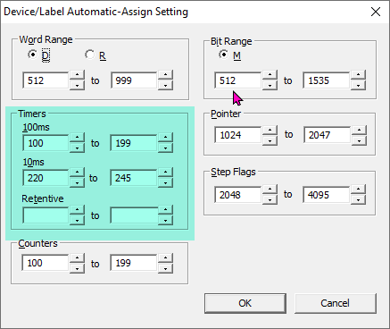
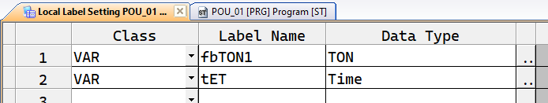
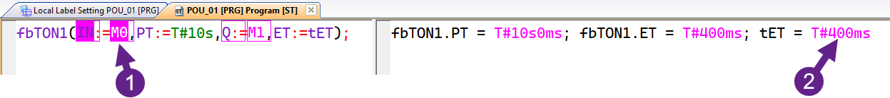

# Таймеры

Таймеры это всегда большая тема, так как это одно из базовых компонентов любой программы на ПЛК. Для FX3G\FX3U тема таймеров еще обширней, так как здесь можно не только применять стандартные Функциональные Блоки, но в встроенные инструкции. В этой теме мы поговорим о:

- Стандарт МЭК-61131-3
- Инструкция `OUT_T`
- Собственный тикер

## Стандарт МЭК-61131-3

Таймеры в FX3G\FX3U можно запускать стандартными Функциональными Блоками `TON`, `TOF`, `TP`.

!!! warning "**Ограничения**"

    Количество Функциональных Блоков которые вы можете создать в программе ограничено, так как под капотом, GX Works 2 использует таймеры области `T` для создания Функциональных Блоков `TON`, `TOF`, `TP`.

    А использует он те таймеры, которые вы выделите в этом окне *Меню / Tools / Device\Label Automatic-Assign Settings...*
    

### TON

Давайте объявим экземпляр блока TON.



Вставим шаблон функции в программу.

```iecst
fbTON1(IN:=M0,PT:=T#10s,Q:=M1,ET:=tET);
```

Эта небольшая программка, если контакт М0 замкнется, контакт М1 замкнется через 10 секунд. D0 будет показывать сколько время осталось до истечения. Давайте просуммируем.



### TOF

### TP

### Задание

Напишите 3 Функциональных Блока `BLINK1`б `BLINK2` и `BLINK3` все делающие одно и тоже что и стандартный Функциональный Блок `BLINK` но каждый с применением разного таймера `TON`, `TOF`, `TP`.

**Входные переменные**

- `IN` - Начало работы
- `TIMELOW` - Время не работы в формате Time.
- `TIMEHI` - Время работы в формате Time.

**Выходные переменные**

- `Q` - Сигнал во время работы.
- `CNT` - Сколько раз моргнул.

## Область **T**

Кроме стандартных Функциональных Блоков таймеров `TON`, `TOF`, `TP` которые мы рассмотрим позже, в GX Works 2 есть свои таймеры, которые имеют свою область памяти и свои ячейки. И если привыкнуть, то работа с такими таймерами достаточно удобная.

| Назначение                      | Диапазон      | Кол. |
| ------------------------------- | ------------- | ---- |
| Шаг 100ms                       | `T0`~`T199`   | 200  |
| Шаг 10ms                        | `T200`~`T245` | 46   |
| Шаг 1ms аккумулятивный EEPROM   | `T246`~`T249` | 4    |
| Шаг 100ms аккумулятивный EEPROM | `T250`~`T255` | 6    |
| Шаг 1ms                         | `T256`~`T319` | 64   |

Каждая ячейка здесь является группой реле и регистров. Обращаться напрямую к ячейке `T0` вы ни когда не будете по крайней мере в ST.

Например `T0` это группа из:

- `TC0` - (Timer Coil) катушка таймера используется для включения таймера.
- `TS0` - (Timer State) контакт таймера, замыкается когда таймер завершает работу.
- `TN0` - (Timer Number) время работы таймера, или сколько таймер уже отработал от начала работы в шагах.

Для работы с таймерам используется инструкция `OUT_T`.

```iecst
OUT_T(X0, TC0, 10);
M0 := TN0 <= 5;
Y0 := TS0;
RST(M1, TC0);
```

Инструкция `OUT_T` принимает 3 параметра.

1. Первый это контакт который указывает условие начала работы таймера. Здесь можно вставить и выражение.
2. Второй параметр, это номер катушки таймера. С каким именно таймером мы будем работать.
3. Третий параметр это время работы таймера. Время работы указывается в шагах. Так как мы использовали таймер `T0`, в таблице видим что его шаг 100ms. Это значит что каждая 1 в этом параметре равно 100мс. Другими словами наше 10 это 1000мс или 1с.

Разберем пример, что там происходит. Когда контакт `X0` замкнется, или другими словами на вход номер 1 ПЛК поступит сигнал, таймер начнет работу. Работать он будет как мы выяснили 1 секунду. Первые 500мс работы таймера контакт M0 будет замкнут а потом разомкнется. Еще через 500мс, а в общем через одну секунду от начала работы таймера активируем катушку `Y0`, так как `TS0` замкнется по окончании работы таймера.

Чтобы таймер перезапустить его нужно сбросить. Сбросить его можно 2мя способами. Когда мы производим сброс, регистр `TN0` сбрасывается в **0** как и контакт `TS0`.

1. Нужно разомкнуть контакт на первом параметре. В нашем примере деактивировать вход `X0`. Тогда при следующем включении таймер снова начнет считать.
2. Можно использовать инструкцию `RST` для катушки `TC0`. Хотя `TC0` это катушка, писать в нее может только система. Из программы `TC0` только для чтения. По этому сбрасывать его можно только через инструкцию Reset `RST` хотя в базе `RST` просто присваивает переменной значение **0**. Тем не менее `TC0 := 0` даст ошибку компиляции что попытка записать в ячейку только для чтения.

## Пример

TODO: Программу пишем тут.

### Задание

Создайте Функциональный Блок таймеров `TON`, `TOF`, `TP`,  с использованием инструкции `OUT_T`. Назовите их `CTON` сокращения (Custom TON),  `CTOF` (Custom TOF) и `CTP` (Custom TP). У всех Функциональных Блоков будет один и тот же набор входных и выходных переменных.

Входные переменные

- `IN` - Начало работы
- `PT` - Время работы в формате Time.

Выходные переменные

- `Q` - Окончание работы
- `ET` - Сколько осталось до конца работы в формате Time.

Так же создайте Функциональный Блок `CBLINK` (Custom BLINK)

Входные переменные

- `IN` - Начало работы
- `TIMELOW` - Время не работы в формате Time.
- `TIMEHI` - Время работы в формате Time.

Выходные переменные

- `Q` - Сигнал во время работы.

Конечно в программе можно будет создать только один экземпляр такого Функционального Блока. Так как если экземпляров будет больше одного, то они оба будут ссылаться на один и тот же внутренний таймер и будет конфликт наложения данных. Другими словами эти Функциональные Блоки совершенно не применимы в реальной программе, но на их примере вы сможете понять как применять инструкцию `OUT_T` во всех 3х сценариях.

## Собственный тикер

До использования GX Works 2, я пользовался CoDeSys. И я сильно привык к функции `TIME()`. Все таймеры `TON`, `TOF` и `TP` написаны с использованием этой функции.

В CoDeSys функция `TIME()` возвращает время в миллисекундах с момента включения или сброса ПЛК, представленное в виде типа данных `DWORD`. `DWORD` — это 32-битное беззнаковое целое число с максимальным значением 4 294 967 295 миллисекунд. Это соответствует примерно 49 дням, 17 часам, 2 минутам, 47 секундам и 295 миллисекундам, после чего значение переполняется и сбрасывается на ноль.

Мы можем в любой момент сохранить точку отсчета, и отсчитать сколько нам нужно времени. Единственное ограничение, это максимальный промежуток времени. Хотя это не так часто когда нам нужно такие большие промежутки времени. В любом случае при таком подходе мы можем использовать таймеры `TON`, `TOF`, `TP` не ограниченное количество раз.

Подобную функцию можно воспроизвести в GX Works 2. Есть 2 основных способа как это сделать.

### Прерывания (Interrupts)

В ПЛК FX3G\FX3U есть 3 вида прерываний. 2 из них связаны со счетчиками и быстрыми входами, а одно со временем. У прерывания есть свои указатели. Все начинаются с буквы `I` потом идет номер события. Для событий времени отделены номера 6, 7 и 8. И далее идет время срабатывания. Например:

- `I610` - срабатывает раз в 10мс зарегистрирован на событии 6.
- `I750` - срабатывает раз в 50мс зарегистрирован на событии 7.

Как нам внедрить подобное прерывание. Давайте создадим новую программу. ПКМ в дереве проекта на POU и добавить новые данные. В окне введем имя TIKER выберем язык ST и убедимся что у нас выбрано Program Block в Data Type.

Откроем глобальные переменные и добавим переменную TKR10. Тип переменной у нас будет **Double Word[Unsigned/Bit String]**. Мы здесь будем хранить значение разрешением в 10мс. То-есть 10 в этой переменной будет значить 100мс. Почему так? Смотрите мы все равно раз в 10мс только будем добавлять, и все равно мы будем увеличивать ее с шагом 10, но если мы будем хранить 1мс, то эта переменная переполнится быстрей. А 10мс позволят хранить почти год.

Что бы добавить нашу программу в прерывания, нужно 2 вещи.

1. В главную программу в самой первой строке вызовем инструкцию `EI(TRUE);` Enable Interrupt. Эта инструкция позволяет любому коду который после нее написан прерываться по прерывателям времени. Естественно подобное нужно вставить и в другие программы если они у вас будут.

    Иногда бывает нужно какой-то участок кода отделить от прерываний, и сделать так чтобы он не прерывался. Можно использовать `DI(TRUE);` *Disable Interrupt* перед этим участком кода и потом опять `EI(TRUE);`.

2. Добавим нашу программу в задачи. Развернем в дереве проекта *Program Settings*, *Execution Program* и ПКМ на MAIN - Добавить новые данные. В открывшемся окне убедимся что Data Type это Task введем имя TIKER и ЛКМ Ок. В дереве увидим новый элемент и у нас откроется страница добавления программы. Жмем на 3 точки, и выбираем нашу программу TIKER. Это еще не все. Теперь на имени задачи ПКМ и выбираем свойства *Property*. В открывшемся окне, в поле *Event* где написано `TRUE` что значит запускать программу непрерывно, мы пишем `I610`.

Еще раз что мы только что сделали. Мы добавили нашу программу в задачи исполнения и указали что она должна исполнятся раз в 10мс. А в основной программе мы разрешили прерывания в любой точке программы.

Давайте напишем нашу программу. Очень простая.

К сожалению на переменных типа **[Unsigned/Bit String]** будь то **Word** или **Double Word** нельзя использовать математические операторы в таком виде.

```iecst
TKR10 := TKR10 + 1;
```

Это даст ошибку. Мы можем использовать только математические инструкции. В нашем случае `DADD`. Впереди `D` потому что мы работаем с *Double Word*.

```iecst
DADD(TRUE, TKR10, 1, TKR10);
```

Ну или еще проще, так как мы просто добавляем еденицу, по сути мы просто инкриминируем. Для этого есть отдельная инструкция.

```iecst
DINC(TRUE, TKR10);
```

Ну вот, теперь переменная `TKR10` будет увеличиваться на 1, раз в 10мс с довольно таки большой точностью.

Давайте проверим, загрузим это все в контроллер и запустим. В симуляции прерывания не работают. Чтобы это проверить нам нужен реальный ПЛК.

### Почему прерывание?

Давайте осудим разницу прерывания и исполнения программы по времени. Допустим мы бы настроили исполнение нашей программы вот так. В событие вписали FALSE то-есть не надо непрерывно исполнять, а в *Interval* вписали `T#10ms` и даже поставили приоритет 1. В чем же тут отличие. По логике эта программа тоже должна исполнятся раз в 10мс. Но при такой конфигурации это скорей не чаще чем раз в 10мс. Допустим 10мс истекло, но мы еще не закончили исполнение другой программы, и хотя наш приоритет самый высокий, мы не запустим эту программу пока предыдущая не закончит свою работу, а сколько на это может уйти времени не известно. Возможно даже больше чем еще 10мс. Таким образом в наше исчислении будет накапливаться ошибка и точность такого тикера будет страдать.

В нашем случае, мы исполним программу TIKER как только исткет 10мс, не важно что основная программа сейчас в работе. Мы прервем работу основной программы, по этому это и называется прерывание, исполним программу TIKER, а потом продолжим исполнение основной программы.

### Дополнительно

Есть еще одна важная инструкция для прерываний по времени, нам она тут не нужна, но может быть полезной для вас в дальнеишем. Это инструкция `REF` - *Refresh*. Вы знаете что программа ПЛК исполняется циклически. Исполняется, после завышения исполняется снова, и так бесконечно. Как мы знаем что чтение значений на входах ПЛК происходит перед каждым началом исполнения программы, а обновление выходов по завершении программы. Инструкция `REF` позволяет досрочно прочитать входа или назначит значения выходам. Например.

Допустим у вас ПЛК 12 входов и 12 выходов.

```iecst
REF(TRUE,X0,12);
REF(TRUE,Y0,12);
```

Такая программа прочитает значения на входах и обновит значения выходов прямо в том месте где исполняются эти инструкции.

Предположим вход `X0` имел значение `TRUE` на начало выполнения программы. Но к середине программы сменился на `FALSE`. Хотя он и сменился в программе он все еще TRUE, потому что значения области `Х` обновляются один раз перед стартом программы. Если мы вызовем инструкции REF то значение `X0` примет текущее значение `FALSE` и после этой инструкции можно смело проверять значение `X0` и знать что мы работаем с актуальными данными.

Или еще пример:

```iecst
Y10 := TRUE;
REF(TRUE,Y10,1);
```

Такая программа активирует выход `Y10` сразу после инструкции `REF` не дожидаясь конца исполнения программы.
