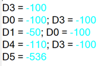

# Переменные

Переменные в GX Works 2 это достаточно большая тема, и не для всех она простая. Даже если у вас есть опыт программирования например в CoDeSys то здесь концепт немного другой и сначала может быть немного не привычно. С другой стороны если вы уже программировали ПЛК такие как Delta или Omron, то трудностей с пониманием может не возникнуть.

## Типы переменных

Стандартные типы переменных в GX Works 2 именуются отлично от стандарта МЭК-61131-3. Есть всего 7 типов.

| Тип                              | МЭК-61131-3      | Бит | Описание                                              |
| -------------------------------- | ---------------- | --- | ----------------------------------------------------- |
| Bit                              | `BOOL`, `BIT`    | 1   | Булева переменная 0/1                                 |
| Word[Signed]                     | `INT`            | 16  | Число со знаком -32,768 до 32,767                     |
| Double Word[Signed]              | `DINT`           | 32  | Число со знаком -2,147,483,648 до 2,147,483,647       |
| Word[Unsigned/Bit String]        | `UINT`, `WORD`   | 16  | Число без знака 0 до 65,535                           |
| Double Word[Unsigned/Bit String] | `UDINT`, `DWORD` | 32  | Число без знака 0 до 4,294,967,296                    |
| FLOAT (Single precision)         | `REAL`           | 32  | С плавающей точкой -2^128^ до +2^128^                 |
| Time                             | `TIME`           | 32  | Время `T#-24d20h31m23s648ms` до `T#24d20h31m23s647ms` |

в GX Works 2 поддерживаются и другие типы данных. Например *FLOAT (Double precision)* это число с плавающей точкой но 64-bit. Или есть *String* как понятно из название это строка. Но они не поддерживаются для FX3G\FX3U, и поэтому мы не будем их рассматривать.

## Блоки (Devices)

Прежде чем научится объявлять переменные, нужно постичь концепт GX Works 2 в отношении блоков.

В контроллерах Mitsubishi вся память разделена на разные области (`D`, `R`, `M`, `Y`, `X`, ...), и каждый блок области памяти пронумерован. Такой блок называют Device. Например `D100`, `M10`, `TC0`, `X001`, `R1000`. Блоки могут быть размером или 1-бит или 16-бит.

Блоки размером 1 бит это *реле* если в блок можно и писать и читать. В контексте записи в блок это *катушки* если в него можно писать, и *контакты* если его можно читать.

На блоки размером 16 бит часто ссылаются как *регистр*. Если мы храним значение больше чем 16-бит, то это значение просто занимает 2 или более *регистров* (блоков).

!!! info "**Информация**"

    В других русских инструкциях Devices переведены как Операнды. Термин **блок** ввожу я, и если вы будете им где то оперировать, вас могут не понять. Еще одно подходящее название для термина Device - **ячейка**. Ссылается на ячейку в области памяти.

Давайте поговорим о самых важных для нас областях памяти.

### Область **X**

| Назначение   | Bit | Доступ | Диапазон      | Значения                 |
| ------------ | --- | ------ | ------------- | ------------------------ |
| Входное реле | 1   | Читать | `X000`~`X377` | `TRUE`, `FALSE` или 0, 1 |

Область памяти напрямую связанная с аппаратными входами ПЛК и является *контактом*. Писать в него нельзя, только читать. Блок `X000` это первый вход, `X001` второй и так далее. Всего **255** входов.

!!! warning "**Считается восьмеричной системой**"

    На FX3G\FX3U данная область памяти считается в восьмеричном формате. Это значит что цифр 8 и 9 в счете нету. `Х0`, `X1`, `X2`, `X3`, `X4`, `X5`, `X6`, `X7`, `X10`, `X11`, и тд. `X0`~`X7`, `X10`~`X17`, `X20`~`X27`, ...

Когда на вход ПЛК поступает ток, контакт меняет сове значение с `FALSE` на `TRUE` или с **0** на **1**. При сравнении данных контакта можно использовать как `TRUE`, `FALSE` так и **0**, **1**.

```iecst
IF X0 = 1 THEN
    Y0 := 1;
END_IF;

IF X2 = FALSE THEN
    Y0 := FALSE;
END_IF;
```

Это просто пример для демонстрации. Так ни кто не пишет естественно. Обычно выражение `IF X0 = 1 THEN` записывают `IF X0 THEN`, а `IF X2 = FALSE THEN` обычно пишут как `IF NOT X2 THEN`, тем не менее данный пример демонстрирует что можно использовать как `TRUE`, `FALSE` так и **0**, **1**.

### Область **Y**

| Назначение    | Bit | Доступ        | Диапазон      | Значения                 |
| ------------- | --- | ------------- | ------------- | ------------------------ |
| Выходное реле | 1   | Читать Писать | `Y000`~`Y377` | `TRUE`, `FALSE` или 0, 1 |

Область памяти напрямую связанная с аппаратными выходами ПЛК и является *реле*. Можно как читать так и писать, но по сути они нужны чтобы именно писать в них. Когда мы пишем в *реле* то это *катушка*, когда читаем это *контакт*. Реле `Y0` это первый выход, `Y1` второй и так далее. Всего **255** реле.

!!! warning "**Считается восьмеричной системой**"

    На FX3G\FX3U данная область памяти считается в восьмеричном формате. Это значит что цифр 8 и 9 в счете нету. `Y0`, `Y1`, `Y2`, `Y3`, `Y4`, `Y5`, `Y6`, `Y7`, `Y10`, `Y11`, и тд. `Y0`~`Y7`, `Y10`~`Y17`, `Y20`~`Y27`, ...

Если присвоить реле `Y0` значение `TRUE` или **1** то ПЛК замкнет соответствующее выходу реле или транзистор если выход транзисторный.

```iecst
Y0 := X0;
Y1 := TRUE;
Y2 := Y0;
```

В первой строке видно что можно писать в *катушку* `Y` значения *контактов* `X` и как дальше увидим `M` и других контактов, которые можно читать. А читать можно любые реле и контакты.

В третей строке мы видим что реле в `Y` можно как писать так и читать из него.

### Область **М**

| Назначение               | Bit | Доступ        | Диапазон        | Значения                 |
| ------------------------ | --- | ------------- | --------------- | ------------------------ |
| Обычные                  | 1   | Читать Писать | `M0`~`M383`     | `TRUE`, `FALSE` или 0, 1 |
| EEPROM энергонезависимые | 1   | Читать Писать | `M384`~`M1535`  | `TRUE`, `FALSE` или 0, 1 |
| Обычные                  | 1   | Читать Писать | `M1536`~`M7679` | `TRUE`, `FALSE` или 0, 1 |
| Системные                | 1   | Читать Писать | `M8000`~`M8511` | `TRUE`, `FALSE` или 0, 1 |

Это область "дополнительных реле", и связана с памятью ПЛК. Называются они "дополнительные реле", потому что не связаны с аппаратной платформой ПЛК, а существуют только в памяти программы. В `M` можно как писать так и читать из них.

!!! info "**Информация**"

    Системные реле `M8000`~`M8511` содержат доступ к аппаратной информации или флаги работы внутренних инструкций или позволяют конфигурировать некоторые аспекты работы ПЛК. Они по большей части совпадают с системными регистрами Mitsubishi. Например `M8002` переходит в состояние `TRUE` один цикл ПЛК на старте, `M8013` меняет свое состояние раз в секунду, если активировать `M8192` то порт 3 перейдет из протокола Mitsubishi в режим Modbus.

    Полный список системных реле `M` смотрите в документации Coolmay к ПЛК L02 [coolmay/Documentation/EN/L02/Coolmay L02 Series PLC Programming Manual V22.111.pdf](../downloads/Coolmay%20L02%20Series%20PLC%20Programming%20Manual%20V22.111.pdf).

### Область **D**

| Назначение               | Bit | Доступ        | Диапазон        | Значения          |
| ------------------------ | --- | ------------- | --------------- | ----------------- |
| Обычные                  | 16  | Читать Писать | `D0`~`D127`     | -32,768 до 32,767 |
| EEPROM энергонезависимые | 16  | Читать Писать | `D128`~`D7999`  | -32,768 до 32,767 |
| Системные                | 16  | Читать Писать | `D8000`~`D8511` | -32,768 до 32,767 |

Основная область памяти для хранения значений переменных числового типа - регистры. Как 16ти битных так и 32ух битных. Регистры этой области ни знают какой тип данных в них хранится если в программе обращаться к регистру напрямую. По умолчанию значения регистра расцениваются как 16ти битные числа `INT`.

```iecst
D3 := -100;
D0 := 0 + D3;
D1 := D0 / 2;
D4 := D3 - 10;
D5 := 65000;
```

Значения при работе будут следующими



Так как это по умолчанию `INT` 16ти битный, то если мы присвоим ему значение больше 32,767, он их примет как `WORD` принимающий от 0 до 65,535, но автоматически сконвертирует значение в `INT`.

!!! tip "**Забегая наперед**"

    В реальных проектах вы вряд ли будете обращаться к регистрам `D`, да и любым другим блоками напрямую, а будете создавать символьные переменные и назначать им нужный тип. Я крайне не рекомендую работать с блоками напрямую, кроме блоков таймеров `Т` и счетчиков `С` и индекса `Z`.

!!! info "**Информация**"

    Системные блоки `M8000`~`M8511` содержат доступ к аппаратной информации или флаги работы внутренних инструкций или позволяют конфигурировать некоторые аспекты работы ПЛК. Они по большей части совпадают с системными регистрами Mitsubishi. Например, `D8000` можно назначить таймер Watchdog, `D8012` содержит максимальное время цикла ПЛК, `D8030` значение на первом аналоговом входе ПЛК от 0~4092.

    Полный список системных регистров `D` смотрите в документации Coolmay к ПЛК L02 [coolmay/Documentation/EN/L02/Coolmay L02 Series PLC Programming Manual V22.111.pdf](../downloads/Coolmay%20L02%20Series%20PLC%20Programming%20Manual%20V22.111.pdf).

### Область **R**

| Назначение               | Bit | Доступ        | Диапазон          | Значения          |
| ------------------------ | --- | ------------- | ----------------- | ----------------- |
| EEPROM энергонезависимые | 16  | Читать Писать | `R0`~`R22999`     | -32,768 до 32,767 |
| Системные                | 16  | Читать Писать | `R23000`~`R23999` | -32,768 до 32,767 |

Регистры области `R` это тоже самое что и `D`. Можно использовать и те и другие. Они все поддерживают сохранение при потере питания.

Системные регистры тут не относятся к системным регистрам Mitsubishi, а зарезервированы Coolmay для их собственных решений. Например: `R23700` хранит значение на первом аналоговом входе модуля расширения и принимает значение 0-32,000.

### Область **T** и **С**

Область хранения данных таймеров и счетчиков. Мы сейчас о них не будем говорить, а подробно рассмотрим их когда будем изучать эту тему.


| Назначение                      | Диапазон      |
| ------------------------------- | ------------- |
| Шаг 100ms                       | `T0`~`T199`   |
| Шаг 10ms                        | `T200`~`T245` |
| Шаг 1ms аккумулятивный EEPROM   | `T246`~`T249` |
| Шаг 100ms аккумулятивный EEPROM | `T250`~`T255` |
| Шаг 1ms                         | `T256`~`T319` |

Таймеры в FX3G\FX3U можно запускать стандартными Функциональными Блоками `TON`, `TOF`, `TP` но так же есть и свой способ работы с таймерами, который если обвыкнутся очень даже не плох.

Каждый блок здесь является группой реле и регистров и обращаться напрямую к блоку `T0` вы ни когда не будете по крайней мере в ST.  Например `T0` это:

- `TC0` - (Timer Coil) катушка таймера используется для назначения номера таймера.
- `TS0` - (Timer State) контакт таймера, замыкается когда таймер завершает работу.
- `TN0` - (Timer Number) время работы таймера, или сколько таймер уже отработал от начала работы в шагах.

Сейчас только небольшой пример что-бы примерно увидеть как это выглядит, вникать не надо, мы будем рассматривать таймеры более подробно.

```iecst
OUT_T(X0, TC0, 10);
M0 := TN0 >= 5;
Y0 := TS0;
```

3й параметр инструкции `OUT_T` - 10 - это 10 шагов. Так как мы использовали таймер `T0`, в таблице видим что его шаг 100ms. Это значит что шаг 100мс умножить на значение 10 - результат общее время 1000мс или 1с.

В этом примере таймер `T0`, потому что мы указали `TC0` запустится когда контакт `X0` замкнется, и катушке `Y0` будет присвоено `TRUE` после одной секунды, так как контакт `TS0` замкнется по окончании работы таймера. А катушке `М0` будет подан `TRUE` через 500мс.

Не буду на этом фокусироваться, если не понятно, ни страшно, это тема не про таймеры а про области памяти, просто того что область памяти `T` относится к таймерам, и каждый таймер это группа из 3х блоков, `TC`, `TS`, `TN`.


## Энергонезависимость

Если вам нужно использовать блоки, так чтобы они сохраняли свои значения после перезагрузки ПЛК то нужно использовать диапазон помеченный как *EEPROM энергонезависимые*. Для `М` это `M384`~`M1535`, для `D` это `D128`~`D7999` и для `R` это все.

```iecst
IF X2 THEN
    M400 := TRUE;
    M2000 := TRUE;

    D0 := 100;
    D200 := 100;
END_IF;
```

В данном примере если мы кратковременно подадим ток на вход `X2` то `M400` и `M2000` примут значение `TRUE` a `D0` и `D200` примут значение **100**. Если после этого перегрузить ПЛК, то только `M400` сохранит значение `TRUE` и `D200` значение **100**, а `M2000` и `D0` будет сброшено в `FALSE` и **0**.

Как это использовать?

Для блоков D я например использую `D0`~`D127` для записи значения с датчиков, расчетные результаты которые делаются каждый цикл программы. А энергонезависимые для создания переменных в которых находятся настройки которые вводятся с панели. Тоже самое относительно блоков М. Я использую энергонезависимый диапазон если например есть кнопка запуска котла, она была включена когда пропало питание, и я хочу чтобы после восстановления питания кнопка так же была включена.

Раз уж мы заговорили об EEPROM нужно упомянуть, все области памяти, в которые нужно жестко записывать для хранения без питания, как правило имеют ограниченное количество циклов записи. Что то, около 50 000. Значит ли это, что если вы используете переменную которая очень часто меняется, например 2 раза в секунду, то через 25 000 секунд она исчерпает ресурс памяти на запись?

Ответ НЕТ. Запись в EEPROM происходит только в момент выключение ПЛК, и чтение в момент загрузки ПЛК. Так что не беспокойтесь. Текущие присвоения значений во время обычной работы ПЛК работают с оперативной памятью которая такими ограничениями не обладает. А если ПЛК включать и выключать хотя бы один раз в день, то ограничения памяти на запись, хватит больше чем на 100 лет.


<!-- Device number table
Name Contents
I/O relay
Input relay X0~X377 256 points It is octal number
Output relay Y000~Y377 256 points Total 512 I/O
Auxiliary relay
General M0~M383 384 points
EEPROM hold M384~M1535 1152 points
General M1536~M7679 6144 points
Special M8000~M8511 512 points
Status
Initial state (EEPROM hold) S0～S9 10 points
EEPROM hold S10～S999 990 points
General S1000～S4095 3096 points
Timer (ON delay timer)
100ms T0～T199 200 points 0.1～3,276.7s
10ms※1 T200～T245 46 points 0.01～327.67s
1ms accumulative (EEPROM hold) T246～T249 4 points 0.001～32.767s
100ms accumulative
(EEPROM hold) T250～T255 6 points 0.1～3,276.7s
1ms T256～T319 64 points 0.001~32.767s
Counter
General up counter (16bit) C0～C15 16 points 0～32,767 counter
EEPROM hold up counter
(16 bit) C16～C199 184 points 0～32,767 counter
General bi-direction (32 bit) C200～C219 20 points -2,147,483,648～
+2,147,483,647 counter
EEPROM hold bi-direction (32 bit) C220～C234 15 points -2,147,483,648～
+2,147,483,647 counter
High-speed counter
Single-phase single counter input
Bi-direction (32 bit) (EEPROM hold) C235～C245
-2,147,483,648～+2,147,483,647 Counter
Software counter
Single phase： at most 6 channel, 60kHz
Double phase： 1 times frequency:at most 2-3
channels, Max frequency 30KHz; M8198 is 4
times frequency sign of C251/C252.
4 times frequency:at most 2 channels,
24kHz,M8199 is 4 times frequency sign of
C253/C255. -->

## Объявление переменных

## Области видимости

В GX Works 2 есть несколько областей видимости переменных.

1. Глобальные
2. Локальные
   1. Локальные
   2. Входные
   3. Выходные
   4. Проходные


## Глобальные

-65,536 to 65,535
0 to 4,294,967,296
2,147,483,648

Глобальнее переменные определяются в списке глобальны переменных.